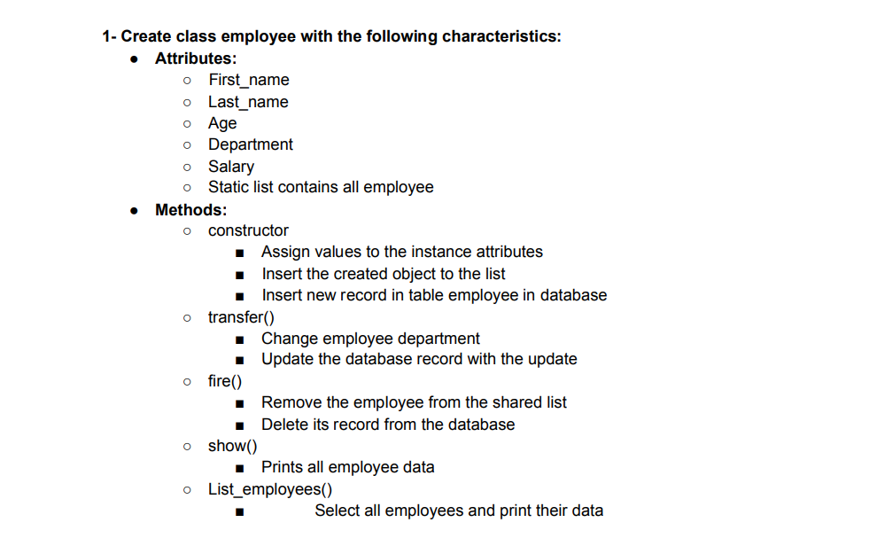
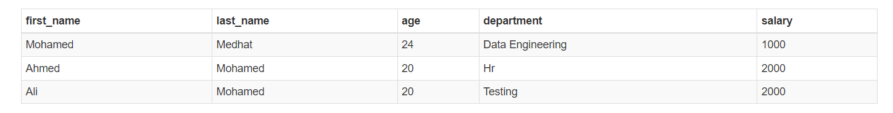
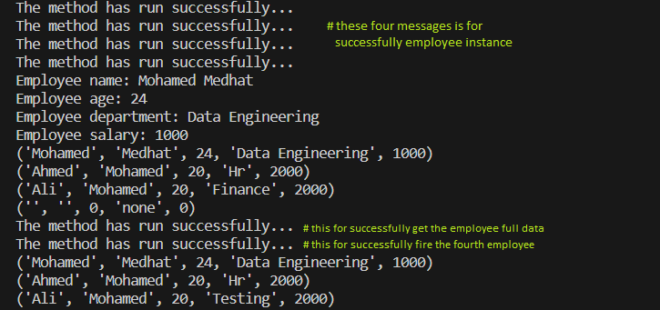

# Creating and Manipulating a SQLite Database in Python
SQLite is a lightweight, serverless, self-contained database engine that you can easily use within Python to store and manipulate data. In this example, we'll walk through the process of creating an SQLite database, creating a table, inserting data, querying data, and updating data using Python.

In this example I created Employee table and did some DMLs on as it explained in the requirement section.   

## Requirements

This is about managing employee records using Python's SQLite library.
It defines a class called Employee to store and manipulate employee data in a database.
Represents an employee with attributes like first name, last name, age, department, and salary.
It has methods to insert, update, and delete employee records, as well as display employee information.   

## Code Brief 
in this code:
* When an employee object is created, it's added to both an internal employee_list and the database. 
The employee's data is inserted into the "employee" table in the database.
* A decorator ***'exceptions_decorator'*** to catch errors in methods and display appropriate messages.
* The code demonstrates basic database operations for employee management.
  * Method **transfer**: updates an employee's department by modifying the corresponding record in the database.  
  * Method **fire**: removes an employee's data from both the employee_list and the database.
  * Method **show**: displays an employee's details such as name, age, department, and salary.
  * **List_employee** (Static Method): retrieves all employee records from the database and displays them.
   

## Results
    
> The employees data results is as shown in the previous pictuere. and the log output is as shown down.   
 

